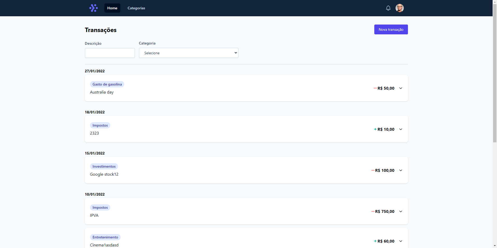
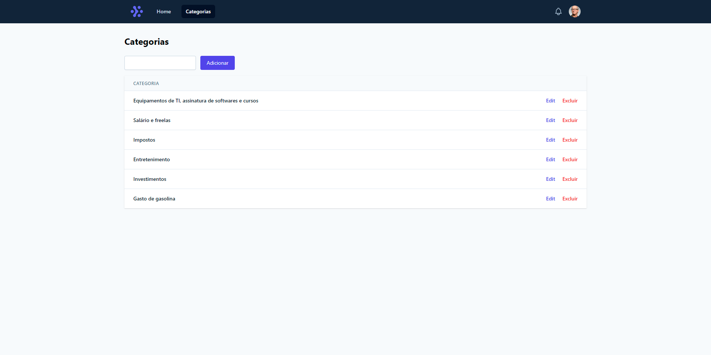

<h1 style="text-align: center; font-weight: bold;">Introdução ao NuxtJs - Tiago Matos</h1>


## Preview 📸
<div align="center" style="display:flex; justify-content: space-between; margin:0 auto;" >
  
  
</div>


<h1 style="margin-bottom: 30px; margin-top: 30px; text-align: center; font-weight: bold;">Projeto em desenvolvimento 🚀</h1>


## Sobre o Projeto
Projeto prático [Controle de Finanças](https://www.youtube.com/playlist?list=PLcoYAcR89n-oU266D5Dy6DT-H8npny_qJ)


### 🛠 Tecnologias
As seguintes ferramentas foram usadas na construção do projeto:

- [Nuxt](https://nuxtjs.org/)
- [JSON Server](https://www.npmjs.com/package/json-server)


### 🎲 Rodando o projeto

```bash
# Instale as dependências
$ yarn install
# ou
$ npm install

# Execute a aplicação
$ yarn dev
# ou
$ npm run dev
```